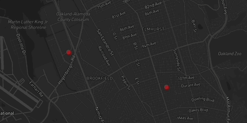

# Day to Day Life

## Demonstration

## What is it?
["Day to Day Life" app](https://github.com/Antono17/my-first-map) , Is a site that shows the places I was at in the summer. It works a lot like Google Maps but it onlu marks the places I was at,

## Why I made this?

This is about my summer. I wanted to remember the places I was visiting the most while in my summer break. So I made this map to show the places I was always at with different markers and small descriptions.

## Technology 

To build this app i used these tools

To build this app, I used the following tools:

1. [Google My Maps](https://www.google.com/maps/d/u/0/), for generating the route lines, and exporting the geometries in `KML` format.
2. [Mapbox GL JS](https://docs.mapbox.com/mapbox-gl-js/guides) library, for styling and displaying maps and route lines, and adding camera behaviors (flyto animations).
3. [Visual Studio Code](https://code.visualstudio.com/download) free IDE, with [Live Server](https://marketplace.visualstudio.com/items?itemName=ritwickdey.LiveServer) and [Markdown All in One](https://marketplace.visualstudio.com/items?itemName=yzhang.markdown-all-in-one) extensions.
4. [GitHub pages](https://docs.github.com/en/pages/getting-started-with-github-pages/creating-a-github-pages-site), for publishing the app for free!

## Code spotlight

Snippet of Code
 
Very small but aggressive

This small peice of code makes the map have the unique design of color and have it already facing at. The thing that was the most diffidult about it is that some of the different map changes didn't work or I got confused on where exactly to put it to make my map still works. I found out that the most simple designs have less problems so I decided just to change the color and keep the same design which make my map work perfectly. My key takeaway is don't overthink when there's a simple way to do it.
